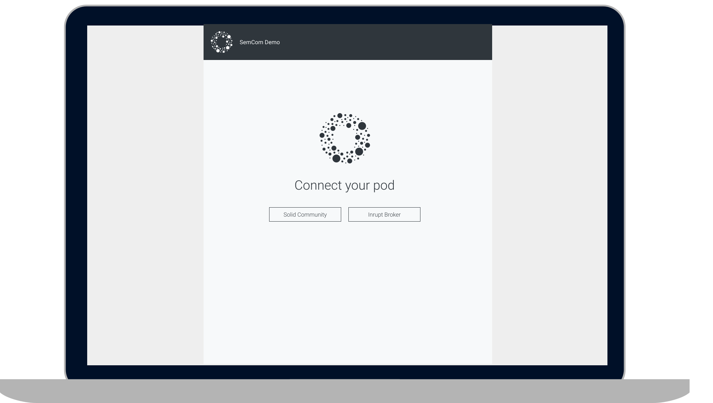

== Technical Specification: Create models and services

=== Author(s)

* Stijn Taelemans

=== References

* Functional analysis: https://www.figma.com/file/pPdyUg0GbiH36wyxcnLsW6/Demo---SemCom?node-id=4%3A385[Figma]
* https://www.wrike.com/open.htm?id=639404034[Wrike task]

* Branch: `feature/639404034-create-login-page`
* Projects:
** https://github.com/digita-ai/semcom[semcom-demo]

=== Introduction

==== Overview

This specification is about the first page in the SemCom demo project which allows a user to login to their Solid pod so that data can be retrieved from it.

=== Solution

_This is a proposed solution and is open to change. If you feel some things can be done better, please discuss with this document's link:###authors[author(s)]._

==== semcom-demo

===== Components

Where possible, I've tried to use Angular Material components. Check out https://material.angular.io/components/categories[the full list of Material components] and https://material.angular.io/guide/getting-started#display-a-component[how to use them] if you haven't already. I've prefixed components with 'demo-' (e.g. <demo-connect-page>). Angular's default prefix is 'app-', so you'll need to change it in the angular.json configuration file. 

Some tips:

You can view styling information (font, font-size, colors, margins, ...) when clicking on components in Figma. It should appear on the right.

Margins in Figma are usually multiples of 10px. https://github.com/digita-ai/dgt-browser/blob/develop/client/theme/utilities/_measures.scss[In dgt-browser], these multiples are bound to scss variables, in the same way you assigned `$color-primary-normal` to `#70808F` in the setup. Feel free to assign them to variables in this project as well.

====== AppComponent

This component is the grey background and will contain the different pages. (connect, profile overview, ...)

This component should already be generated when the project was created. The grey used for the background in Figma should be `#EEEEEE`. Feel free to assign this value to a variable, like you've done in the setup for `$color-primary-light`, `$color-primary-normal`, ...

The HTML of this component should only contain one `
` with a `<router-outlet>` (https://angular.io/guide/router-tutorial-toh[Angular Router]) inside. Set the background color on the `
` and stretch it to cover the whole page if needed.

====== DemoConnectPageComponent

This component is the first page a user sees when they open the app. It constists of a `MatToolbar` at the top, our logo, a title and some buttons to connect with different pod providers. I've chosen Solid Community and the new Inrupt Solid server, but any Solid server should work. 

The finished component should look like this:

Generate under app/features/connect/pages/connect-page.component.ts (selector: <demo-connect-page>)

https://angular.io/api/core/OnInit[Upon initialization], the component dispatches the `LoadProviders` action, so that the `Provider`s will be retrieved from the `ProviderService`. (defined later in this document). It should also https://ngrx.io/guide/component-store/read[fetch the providers from the state] and stored in a variable such as `this.providers: Provider[]` within the component, so that they can be used on in the HTML of the component. (See also: https://angular.io/guide/template-syntax[Template syntax])

When one of the buttons is clicked, the `Connect` action should be dispatched. (defined later in this document)

====== DemoConnectCallbackPageComponent

This component is the first page a user sees when they open the app. It constists of a `MatToolbar` at the top, our logo, a title and some buttons to connect with different pod providers. I've chosen Solid Community and the new Inrupt Solid server, but any Solid server should work. 

Generate under app/features/connect/pages/connect-callback.component.ts (selector: <demo-connect-callback>)

The finished component does not have to contain HTML. If you want, you can add a mat-progress-spinner to the page.
The page should dispatch `ConnectFinished` when the Inrupt SDK has successfully read the data from the url and updated the session. (See: https://docs.inrupt.com/developer-tools/javascript/client-libraries/tutorial/authenticate/#in-a-browser-environment[Inrupt SDK authentication documentation], step 2)

`ConnectCallback` should then navigate us away from this page. (defined later in this document)

===== Routing 

Configure the routing as follows:

Path 'connect' should load `ConnectPageComponent`.
Path 'connect/callback' should load `ConnectCallback`
Path '' should load `ConnectPageComponent`.
Any other path should also load `ConnectPageComponent`

Feel free to create a simple 404 page if you want

===== Models

====== Provider

Create under app/features/connect/models/provider.model.ts

This class describes a pod provider and is used to connect and show on the connect page.

| Attribute | Type
| ================
| `name` | `string`
| `url` | `string`
| ================

===== Services

====== ProviderService

Generate under app/features/connect/services/provider.service.ts

This service contains a basic list of providers which can be retrieved by calling its `all(): Observable<Provider[]>` function. In the mockup, two `Provider`s are shown. Feel free to add other `Provider`s to this service if you would like to connect to different Solid servers.

===== Actions

https://ngrx.io/guide/store/actions

| Action 	| Effect 	| Reducer 	
|======================================
| `Connect` | Use the Inrupt SDK to login. | None 
| `ConnectFinished` | None | Overwrite `action.sessionInfo` in the connect feature's state. 
| `LoadProviders` | Use `ProviderService` to retrieve `Provider`s | None 
| `LoadProvidersFinished` | None | Overwrite `action.providers` in the connect feature's state. 
|======================================

We use the `type` attribute as follows: `[Feature Name] Action Name`, as opposed to `[Page/Component Name] Action Name` example in the NgRx documentation.
Actions in general are grouped by feature, not by a page or a component.

| Action | Type | Attributes
| ================
| `Connect` | `[Connect] Connect` | `{ loginUri: string }`
| `ConnectFinished` | `[Connect] Connect Finished` | `{ sessionInfo: ISessionInfo }`
| `LoadProviders` | `[Connect] Load Providers` | None
| `LoadProvidersFinished` | `[Connect] Load Providers Finished` | `{ providers: Provider[] }`
| ================

===== Effects

https://ngrx.io/guide/effects

====== ConnectEffects

Create effects file: app/features/connect/connect.effects.ts

| Effect | Description
| ================
| `connect$` | This effects should call the `login()` function of the Inrupt SDK. (See: https://docs.inrupt.com/developer-tools/javascript/client-libraries/tutorial/authenticate/#in-a-browser-environment[authentication documentation], step 1) The redirect URI is should be the same as the `DemoConnectCallbackPageComponent`'s route.
| `loadProviders$` | Use `ProviderService.all()` to retrieve a list of `Provider`s. When retrieved, pass the list of providers to a `LoadProvidersFinished` action dispatch.
| ================

===== Reducers

https://ngrx.io/guide/store/reducers

State shape: 

[source, js]
----
{
    "sessionInfo": ISessionInfo,
    "providers": Provider[]
}
----

Initial values for these attributes is `null`.

| Reducer | Description
| ================
| `on ConnectFinished` | Set the connect state's `sessionInfo` to the `ConnectFinished` action's attribute `sessionInfo`. (See: https://ngrx.io/guide/store/reducers#creating-the-reducer-function[setScores action and reducer] for an example of a reducer that uses an action's payload)
| `on ` | Use `ProviderService.all()` to retrieve a list of `Provider`s. When retrieved, pass the list of providers to a `LoadProvidersFinished` action dispatch.
| ================

Don't forget to https://ngrx.io/guide/store/reducers#registering-root-state[register root/feature state], if you haven't done this already.

===== Translations

`common.header.title` (SemCom Demo)
`onboarding.pages.connect-page.title` (Connect your pod)
